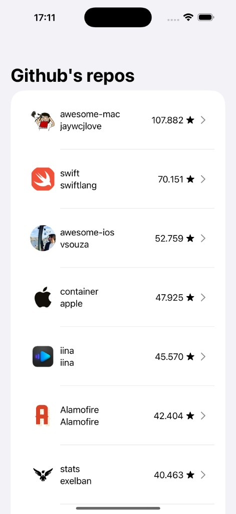
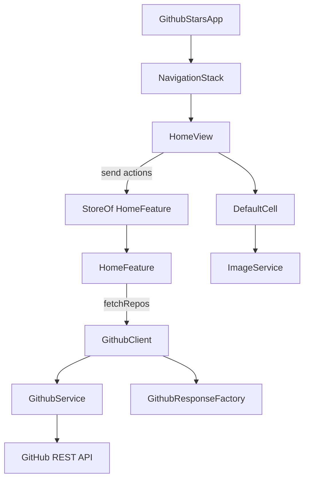

# GithubStars

iOS app that lists popular Swift repositories from the [GitHub Search API](https://docs.github.com/en/rest/search/search). Built with SwiftUI, async/await, and [The Composable Architecture](https://github.com/pointfreeco/swift-composable-architecture) (TCA).



## Stack

| Technology | Role |
|------------|------|
| SwiftUI | UI layer |
| TCA 1.26 | State management for the home screen |
| Swift Package Manager | Dependencies (no CocoaPods) |
| async/await | Networking and image loading |

**Requirements:** Xcode, iOS 18.6 deployment target (app target). Open `GithubStars.xcodeproj`.

## Architecture overview



Data flows in one direction: the view sends **actions**, the **reducer** updates **state** and runs **effects**, and the view re-renders from the **store**.

## Project structure

```
GithubStars/
├── GithubStarsApp.swift          # @main entry, creates Store + HomeView
├── designsystem/
│   └── DefaultCell.swift         # Reusable SwiftUI list row
├── modules/
│   ├── home/
│   │   ├── data/model/           # Codable API models + RepositoryResponse
│   │   ├── domain/factory/       # GithubResponseFactory mapping
│   │   └── presentation/
│   │       ├── feature/          # HomeFeature @Reducer
│   │       ├── dependency/       # GithubClient TCA dependency
│   │       └── view/             # HomeView
│   └── services/                 # GithubService, ImageService
├── resources/                    # Assets, LaunchScreen
└── util/                         # Extensions, accessibility helpers
```

### Home module layers

- **data** — Raw API shapes: `Repo`, `Owner`, `GithubResponse`, plus UI-facing `RepositoryResponse`.
- **domain** — `GithubResponseFactory` maps API responses into `[RepositoryResponse]`.
- **presentation** — TCA feature (reducer), dependency client, and SwiftUI view.

Shared **services** (`GithubService`, `ImageService`) live under `modules/services/` and are consumed directly or via TCA dependencies.

## The Composable Architecture (Home feature)

The home screen is the first (and only) TCA feature. It follows unidirectional data flow.

| Layer | File | Responsibility |
|-------|------|----------------|
| View | `GithubStars/modules/home/presentation/view/HomeView.swift` | Renders UI from `store` state; sends actions |
| Reducer | `GithubStars/modules/home/presentation/feature/HomeFeature.swift` | State transitions and async effects |
| Dependency | `GithubStars/modules/home/presentation/dependency/GithubClient.swift` | Injectable API boundary |
| Store | `GithubStars/GithubStarsApp.swift` | Creates and hosts the store |

### State and actions

`HomeFeature.State` holds:

- `repos` — list of `RepositoryResponse`
- `isLoading` — fetch in progress
- `errorMessage` — drives alert presentation

`HomeFeature.Action` includes:

- `.onAppear` / `.refresh` — trigger a fetch
- `.fetchResponse(Result<...>)` — effect callback with success or failure
- `.onClick` — row tap (placeholder alert)
- `.dismissError` — clear the alert

### Action flow (async fetch)

1. `HomeView` `.task` sends `.onAppear`.
2. Reducer sets `isLoading = true` and returns a `.run` effect.
3. Effect calls `githubClient.fetchRepos()` and sends `.fetchResponse`.
4. Reducer updates `repos` or `errorMessage`.
5. View re-renders via `@Bindable var store`.

```swift
// HomeView — trigger load
.task { store.send(.onAppear) }

// HomeFeature — start effect
case .onAppear, .refresh:
    state.isLoading = true
    return .run { send in
        await send(.fetchResponse(
            Result { try await githubClient.fetchRepos() }
        ))
    }
```

### Sync vs async in the reducer

Two patterns appear in `HomeFeature`:

**Sync UI updates** — set state and return `.none`:

```swift
case .onClick:
    state.errorMessage = "Feature under construction"
    return .none
```

**Async work** — return `.run` and send a follow-up action when done (same pattern as `.onAppear` / `.refresh` above).

### Dependency injection

`GithubClient` wraps networking and mapping so the reducer stays testable:

- `liveValue` — calls `GithubService` + `GithubResponseFactory` (production)
- `previewValue` — returns hardcoded repos for SwiftUI previews

Previews override the dependency:

```swift
HomeView(store: Store(initialState: HomeFeature.State()) {
    HomeFeature()
} withDependencies: {
    $0.githubClient = .previewValue
})
```

### App entry

```swift
@main
struct GithubStarsApp: App {
    var body: some Scene {
        WindowGroup {
            NavigationStack {
                HomeView(
                    store: Store(initialState: HomeFeature.State()) {
                        HomeFeature()
                    }
                )
            }
        }
    }
}
```

## Networking and data flow

1. **GithubService** (`modules/services/GithubService.swift`) — `URLSession.shared.data(from:)` against `Endpoints.home`, decodes `GithubResponse`.
2. **GithubResponseFactory** (`modules/home/domain/factory/GithubResponseFactory.swift`) — maps `GithubResponse.items` to `[RepositoryResponse]`.
3. **GithubClient** — TCA boundary that composes service + factory for the reducer.
4. **ImageService** (`modules/services/ImageService.swift`) — actor used by `DefaultCell` for avatar loading; not wired through TCA yet.

## Getting started

1. Clone the repository.
2. Open `GithubStars.xcodeproj` in Xcode.
3. Let Xcode resolve Swift Package Manager dependencies (TCA and its transitive packages).
4. On first build, approve TCA Swift macros if Xcode prompts you.
5. Run on a simulator. The home screen loads repos on appear; pull down to refresh.

## Current scope and limitations

- **Single feature** — No root `AppReducer` or multi-screen navigation yet.
- **Row tap** — Shows a placeholder alert; no detail screen.
- **No unit tests** — Test target was removed during the SPM/TCA migration.
- **Legacy removed** — CocoaPods, RxSwift, storyboard-based home, and UIKit `ViewController` are gone.
- **Design system** — `DefaultCell` is a plain SwiftUI view, not a TCA sub-feature.

## License

Copyright Alex Rodrigues. All rights reserved.
